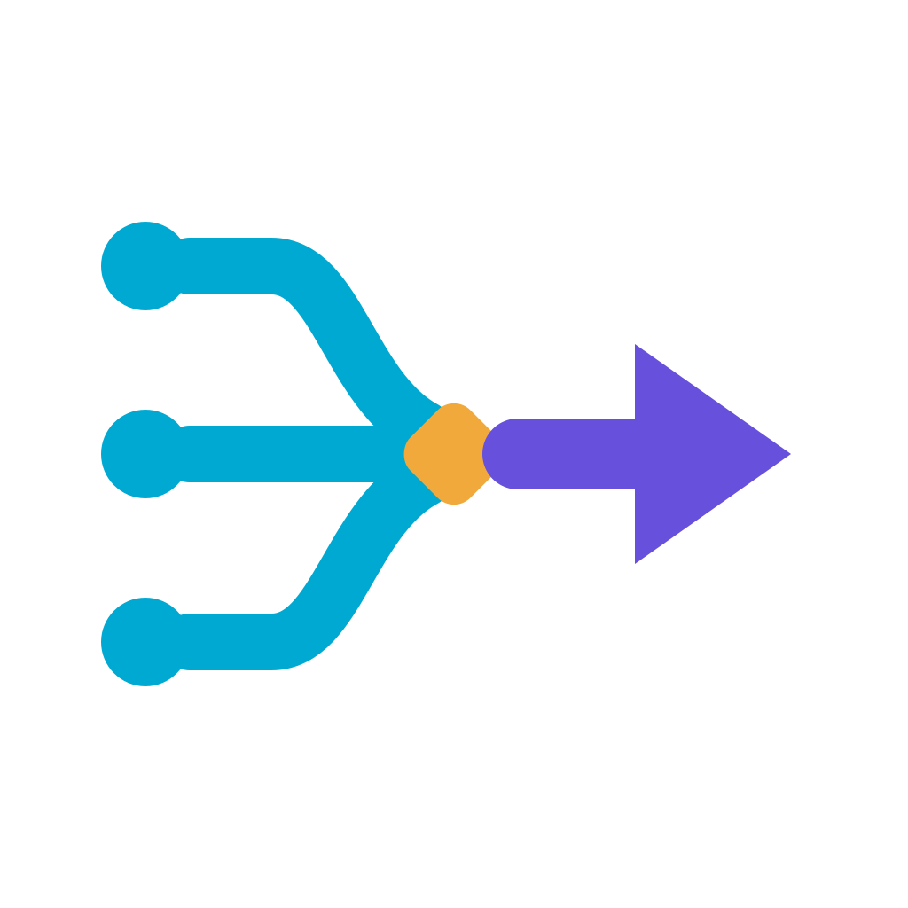

<p align="center">
  
</p>

# Amazon kinesis producer [![CI status][ci-image]][ci-url] [![License][license-image]][license-url] [![Go Reference][godoc-img]][godoc-url]
> A KPL-like batch producer for Amazon Kinesis built on top of the official AWS SDK for Go V2
and using the same aggregation format that [KPL][kpl-url] use.  

### Useful links
- [Documentation site][docs-url]
- [Go Reference][godoc-url]
- [Optional CBOR + gzip transport][cbor-gzip-url]
- [Aggregation format][aggregation-format-url]
- [Considerations When Using KPL Aggregation][kpl-aggregation]
- [Consumer De-aggregation][de-aggregation]

### Optional: smaller `PutRecords` wire payloads

This project maintains an optional fork of the AWS SDK for Go V2 Kinesis
client. It keeps the same Go imports and API while changing the
client-to-Kinesis transport:

- Smithy RPC v2 CBOR encodes record data as native byte strings, avoiding
  JSON base64 expansion.
- `PutRecords` request bodies use gzip by default when the serialized body is
  at least 10 KiB, the AWS SDK's default request-compression threshold.
- KPL aggregation, the bytes stored in Kinesis, and consumer de-aggregation
  are unchanged.

Enable it in the consuming application's module:

```sh
go mod edit --replace \
  github.com/aws/aws-sdk-go-v2/service/kinesis=github.com/kinesis-producer-go/aws-sdk-go-v2/service/kinesis@kinesis-rpcv2-cbor-gzip
go mod tidy
```

`go mod tidy` resolves the branch tip to an immutable Go pseudo-version.
Re-run the same two commands to pick up a newer branch tip. No application
code changes are required; continue importing
`github.com/aws/aws-sdk-go-v2/service/kinesis` and constructing the client
with `kinesis.NewFromConfig`.

See [CBOR + gzip transport][cbor-gzip-url] for behavior, scope, configuration,
verification, and rollback details.

### Example
```go
package main

import (
	"context"
	"log"
	"net/http"
	"time"

	"github.com/aws/aws-sdk-go-v2/aws"
	"github.com/aws/aws-sdk-go-v2/config"
	"github.com/aws/aws-sdk-go-v2/service/kinesis"
	"github.com/kinesis-producer-go/kinesis-producer"
)

func main() {
	transport := http.DefaultTransport.(*http.Transport).Clone()
	transport.MaxIdleConns = 20
	transport.MaxIdleConnsPerHost = 20
	httpClient := &http.Client{
		Transport: transport,
	}
	cfg, err := config.LoadDefaultConfig(context.TODO(), config.WithRegion("us-west-2"), config.WithHTTPClient(httpClient))
	if err != nil {
		log.Fatalf("unable to load SDK config, %v", err)
	}
	client := kinesis.NewFromConfig(cfg)
	pr := producer.New(&producer.Config{
		StreamName:   new("test"),
		BacklogCount: 2000,
		Client:       client,
	})

	pr.Start()

	// Handle failures
	go func() {
		for r := range pr.NotifyFailures() {
			// r contains `Data`, `PartitionKey` and `Error()`
			log.Printf("failure record: %+v\n", r)
		}
	}()

	go func() {
		for i := 0; i < 5000; i++ {
			err := pr.Put([]byte("foo"))
			if err != nil {
				log.Printf("error producing: %+v\n", err)
				time.Sleep(1 * time.Second)
			}
		}
	}()

	time.Sleep(1 * time.Minute)
	pr.Stop()
}
```

#### Specifying logger implementation
`producer.Config` takes an optional `logging.Logger` implementation.

##### Using a custom logger handler
```go
    logger := slog.New(
        slog.NewTextHandler(os.Stdout, &slog.HandlerOptions{
            Level: slog.LevelError,
        }),
    )
    pr := producer.New(&producer.Config{
        StreamName:   new("test"),
        BacklogCount: 2000,
        Client:       client,
        Logger:       logger,
    })
```

#### Using logrus

```go
import (
	"github.com/kinesis-producer-go/kinesis-producer"
	sloglogrus "github.com/samber/slog-logrus/v2"
	"github.com/sirupsen/logrus"
)

    logrusLogger := logrus.New()
    logger := slog.New(sloglogrus.Option{Level: slog.LevelError, Logger: logrusLogger}.NewLogrusHandler())

    pr := producer.New(&producer.Config{
        StreamName:   new("test"),
        BacklogCount: 2000,
        Client:       client,
        Logger:       logger,
    })
```

### License
[MIT][license-url]

[docs-url]: https://kinesis-producer-go.github.io/
[cbor-gzip-url]: https://kinesis-producer-go.github.io/cbor-gzip
[godoc-url]: https://pkg.go.dev/github.com/kinesis-producer-go/kinesis-producer
[godoc-img]: https://pkg.go.dev/badge/github.com/kinesis-producer-go/kinesis-producer.svg
[kpl-url]: https://github.com/awslabs/amazon-kinesis-producer
[de-aggregation]: http://docs.aws.amazon.com/kinesis/latest/dev/kinesis-kpl-consumer-deaggregation.html
[kpl-aggregation]: http://docs.aws.amazon.com/kinesis/latest/dev/kinesis-producer-adv-aggregation.html
[aggregation-format-url]: https://github.com/kinesis-producer-go/kinesis-producer/blob/main/aggregation-format.md
[license-image]: https://img.shields.io/badge/license-MIT-blue.svg?style=flat-square
[license-url]: LICENSE
[ci-image]: https://github.com/kinesis-producer-go/kinesis-producer/actions/workflows/ci.yml/badge.svg
[ci-url]: https://github.com/kinesis-producer-go/kinesis-producer/actions/workflows/ci.yml
